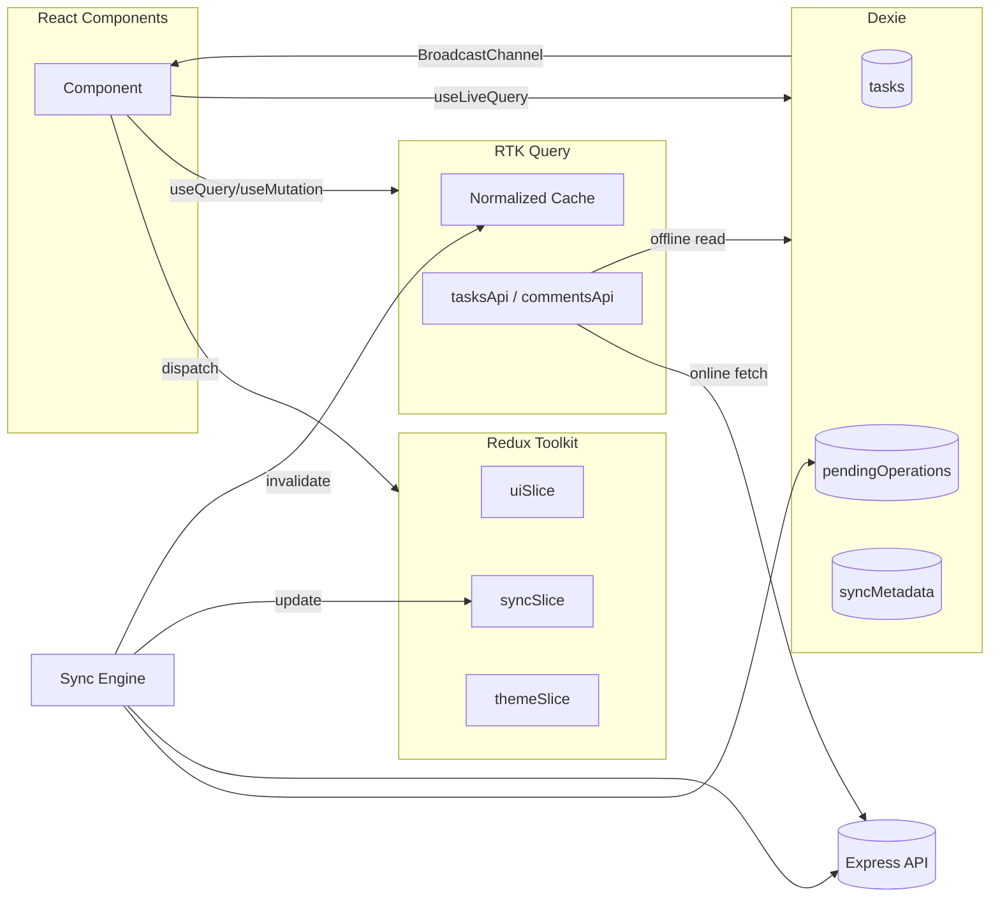
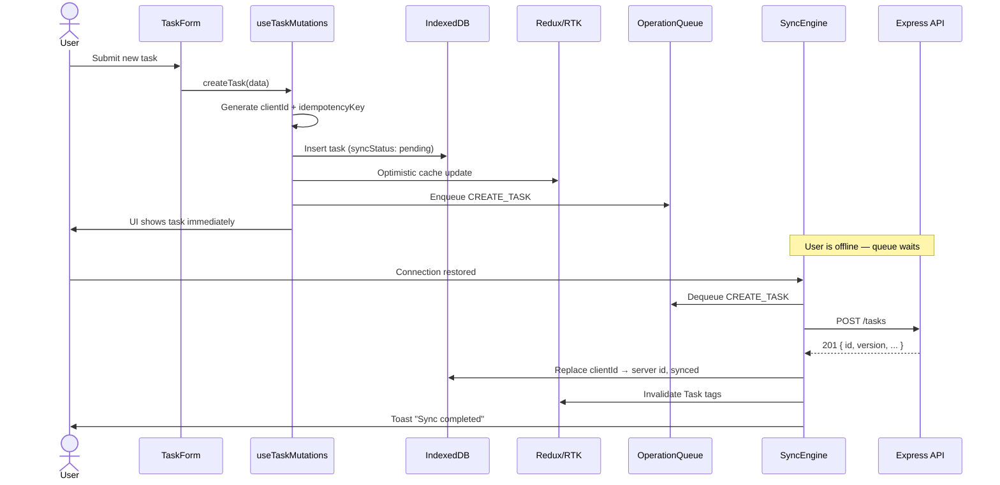
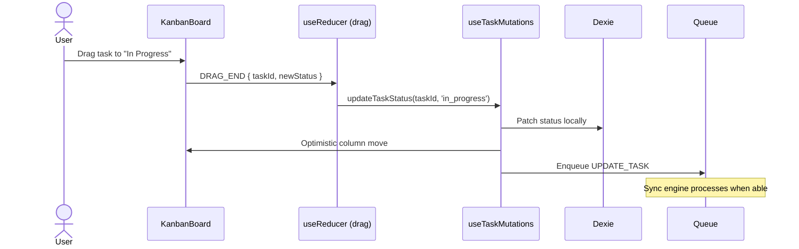
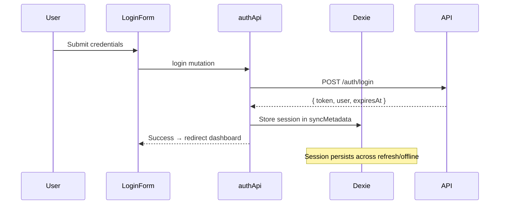
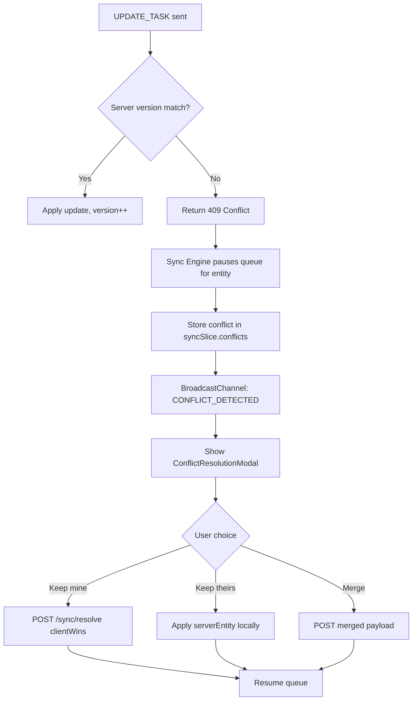

# Offline First Task Management Platform — Architecture & Design

> **Status:** Design phase — awaiting approval before implementation.

---

## Table of Contents

1. [Architecture Overview](#1-architecture-overview)
2. [Folder Structure](#2-folder-structure)
3. [Offline Synchronization Architecture](#3-offline-synchronization-architecture)
4. [State Management Architecture](#4-state-management-architecture)
5. [Data Flow Diagram](#5-data-flow-diagram)
6. [API Design](#6-api-design)
7. [Conflict Resolution Strategy](#7-conflict-resolution-strategy)
8. [Testing Strategy](#8-testing-strategy)
9. [Accessibility Strategy](#9-accessibility-strategy)
10. [README Structure](#10-readme-structure)

---

## 1. Architecture Overview

### 1.1 System Context

The platform is a **monorepo** with three deployable surfaces:

| Surface | Role |
|---------|------|
| **Web Client** (Astro + React islands) | Primary UX; offline-first data layer; sync engine |
| **API Server** (Express + TypeScript) | Auth, persistence, conflict detection, sync endpoints |
| **Service Worker** | Asset caching, offline shell, background sync bridge |

```
┌─────────────────────────────────────────────────────────────────────────┐
│                           Browser (Client)                              │
│  ┌──────────────┐  ┌──────────────┐  ┌──────────────┐  ┌─────────────┐ │
│  │ Astro Shell  │  │ React Islands│  │ Redux + RTK  │  │ Dexie (IDB) │ │
│  │ (SSR/SSG)    │  │ (Dashboard,  │  │ Query        │  │ Offline DB  │ │
│  │              │  │ Kanban, etc.)│  │              │  │ + Queue     │ │
│  └──────┬───────┘  └──────┬───────┘  └──────┬───────┘  └──────┬──────┘ │
│         │                 │                 │                 │        │
│         └─────────────────┴────────┬────────┴─────────────────┘        │
│                                    │                                     │
│                          ┌─────────▼─────────┐                           │
│                          │  Sync Engine       │                           │
│                          │  (Queue, Retry,    │                           │
│                          │   Conflict UI)     │                           │
│                          └─────────┬─────────┘                           │
│                                    │                                     │
│                          ┌─────────▼─────────┐                           │
│                          │  Service Worker    │                           │
│                          │  (Cache, Bg Sync)  │                           │
│                          └─────────┬─────────┘                           │
└────────────────────────────────────┼─────────────────────────────────────┘
                                     │ HTTPS (when online)
                                     ▼
┌─────────────────────────────────────────────────────────────────────────┐
│                        Express API Server                               │
│  ┌──────────┐  ┌──────────┐  ┌──────────┐  ┌──────────────────────┐  │
│  │ Auth     │  │ Tasks    │  │ Comments │  │ Sync / Conflict API  │  │
│  │ (JWT)    │  │ CRUD     │  │ CRUD     │  │                      │  │
│  └────┬─────┘  └────┬─────┘  └────┬─────┘  └──────────┬───────────┘  │
│       └─────────────┴─────────────┴───────────────────┘               │
│                              │                                          │
│                    ┌─────────▼─────────┐                                │
│                    │ PostgreSQL / SQLite │                                │
│                    │ (server persistence)│                                │
│                    └───────────────────┘                                │
└─────────────────────────────────────────────────────────────────────────┘
                                     │
                                     ▼
                              ┌─────────────┐
                              │   Sentry    │
                              │ (monitoring)│
                              └─────────────┘
```

### 1.2 Architectural Principles

| Principle | Implementation |
|-----------|----------------|
| **Local-first writes** | All mutations write to IndexedDB first; UI updates immediately |
| **Eventual consistency** | Server is source of truth after sync; conflicts surfaced explicitly |
| **Separation of concerns** | UI state (Redux), server cache (RTK Query), offline persistence (Dexie) |
| **Fail-safe** | No data loss on network failure; queue survives tab close and refresh |
| **Observable** | Sync lifecycle events, Sentry breadcrumbs, structured logging |
| **Progressive enhancement** | App shell loads from SW cache; React hydrates with local data |

### 1.3 Layer Responsibilities

```
Presentation Layer (React + Mantine)
  └── Route-level code splitting (React.lazy + Suspense)
  └── Feature components (Kanban, TaskList, Dashboard)
  └── Error boundaries per feature zone

Application Layer (Hooks + Sync Engine)
  └── useSyncStatus, useOfflineQueue, useTaskMutations
  └── Orchestrates optimistic updates + queue enqueue

State Layer
  └── Redux Toolkit → UI, theme, sync status, notifications
  └── RTK Query → Server-fetched entities with cache invalidation
  └── Dexie → Durable offline store + operation queue

Infrastructure Layer
  └── Service Worker → precache, runtime cache, background sync
  └── BroadcastChannel → cross-tab sync
  └── Sentry → errors, performance, sync failure alerts
```

### 1.4 Technology Rationale (Summary)

| Choice | Why |
|--------|-----|
| **Astro** | Fast static shell, SEO-friendly auth pages, React islands only where interactivity is needed |
| **Dexie** | Typed IndexedDB wrapper, transactions, observable queries, mature ecosystem |
| **RTK Query** | Normalized server cache, tag-based invalidation, integrates with Redux DevTools |
| **Service Worker** | Offline app shell, background sync API, network interception |
| **Express** | Lightweight, well-understood REST API; easy to test with supertest |

### 1.5 Deployment Topology

```
┌──────────────┐     ┌──────────────┐     ┌──────────────┐
│ CDN / Static │     │ API Server   │     │ Database     │
│ (Astro build)│────▶│ (Node/Express│────▶│ (PostgreSQL) │
│ + SW         │     │  container)  │     │              │
└──────────────┘     └──────────────┘     └──────────────┘
```

- **Client:** Static assets on CDN; `sw.js` registered at root scope
- **API:** Containerized Express behind reverse proxy (CORS, rate limiting)
- **Env separation:** `development`, `staging`, `production` with distinct Sentry DSNs

---

## 2. Folder Structure

```
offline-first-task-management-app/
├── README.md
├── ARCHITECTURE.md                 # This document
├── package.json                    # Workspace root (npm workspaces)
├── turbo.json                      # Optional: build orchestration
├── .env.example
├── .github/
│   └── workflows/
│       ├── ci.yml                  # Lint, typecheck, unit, integration
│       └── e2e.yml                 # Playwright on PR
│
├── apps/
│   ├── web/                        # Astro + React frontend
│   │   ├── astro.config.mjs
│   │   ├── tsconfig.json
│   │   ├── vitest.config.ts
│   │   ├── playwright.config.ts
│   │   ├── public/
│   │   │   ├── favicon.svg
│   │   │   └── manifest.webmanifest
│   │   └── src/
│   │       ├── pages/              # Astro pages (thin shells)
│   │       │   ├── index.astro
│   │       │   ├── login.astro
│   │       │   ├── dashboard.astro
│   │       │   ├── tasks/
│   │       │   │   ├── index.astro       # List view
│   │       │   │   └── [id].astro        # Task detail
│   │       │   ├── kanban.astro
│   │       │   └── settings.astro
│   │       │
│   │       ├── layouts/
│   │       │   ├── BaseLayout.astro
│   │       │   └── AppLayout.astro
│   │       │
│   │       ├── components/         # Shared Astro components
│   │       │   └── Meta.astro
│   │       │
│   │       ├── islands/            # React entry points (client:load)
│   │       │   ├── AppProviders.tsx
│   │       │   ├── DashboardApp.tsx
│   │       │   ├── KanbanApp.tsx
│   │       │   ├── TaskListApp.tsx
│   │       │   ├── TaskDetailApp.tsx
│   │       │   ├── LoginForm.tsx
│   │       │   └── SettingsApp.tsx
│   │       │
│   │       ├── features/           # Feature-sliced React modules
│   │       │   ├── auth/
│   │       │   │   ├── components/
│   │       │   │   ├── hooks/
│   │       │   │   └── schemas/
│   │       │   ├── dashboard/
│   │       │   │   ├── components/
│   │       │   │   │   ├── StatsCards.tsx
│   │       │   │   │   └── SyncStatusBanner.tsx
│   │       │   │   └── hooks/
│   │       │   ├── tasks/
│   │       │   │   ├── components/
│   │       │   │   │   ├── TaskForm.tsx
│   │       │   │   │   ├── TaskCard.tsx
│   │       │   │   │   └── TaskFilters.tsx
│   │       │   │   ├── hooks/
│   │       │   │   │   ├── useTaskMutations.ts
│   │       │   │   │   └── useTaskFilters.ts
│   │       │   │   └── schemas/
│   │       │   │       └── task.schema.ts      # Zod
│   │       │   ├── kanban/
│   │       │   │   ├── components/
│   │       │   │   │   ├── KanbanBoard.tsx
│   │       │   │   │   ├── KanbanColumn.tsx
│   │       │   │   │   └── DraggableTaskCard.tsx
│   │       │   │   └── hooks/
│   │       │   │       └── useKanbanDragDrop.ts
│   │       │   ├── comments/
│   │       │   │   ├── components/
│   │       │   │   └── hooks/
│   │       │   ├── sync/
│   │       │   │   ├── components/
│   │       │   │   │   ├── SyncNotifications.tsx
│   │       │   │   │   ├── OfflineBanner.tsx
│   │       │   │   │   └── ConflictResolutionModal.tsx
│   │       │   │   └── hooks/
│   │       │   │       ├── useSyncStatus.ts
│   │       │   │       └── useNetworkStatus.ts
│   │       │   └── settings/
│   │       │       ├── components/
│   │       │       └── hooks/
│   │       │
│   │       ├── store/              # Redux + RTK Query
│   │       │   ├── index.ts
│   │       │   ├── hooks.ts        # typed useAppDispatch/Selector
│   │       │   ├── slices/
│   │       │   │   ├── uiSlice.ts
│   │       │   │   ├── themeSlice.ts
│   │       │   │   ├── syncSlice.ts
│   │       │   │   └── notificationSlice.ts
│   │       │   └── api/
│   │       │       ├── baseApi.ts
│   │       │       ├── authApi.ts
│   │       │       ├── tasksApi.ts
│   │       │       ├── commentsApi.ts
│   │       │       └── syncApi.ts
│   │       │
│   │       ├── offline/            # Offline-first core
│   │       │   ├── db/
│   │       │   │   ├── database.ts           # Dexie instance
│   │       │   │   ├── schema.ts               # Table definitions
│   │       │   │   └── migrations.ts
│   │       │   ├── queue/
│   │       │   │   ├── operationQueue.ts
│   │       │   │   ├── operationTypes.ts
│   │       │   │   └── queueProcessor.ts
│   │       │   ├── sync/
│   │       │   │   ├── syncEngine.ts           # Main orchestrator
│   │       │   │   ├── syncScheduler.ts
│   │       │   │   ├── retryStrategy.ts        # Exponential backoff
│   │       │   │   └── conflictResolver.ts
│   │       │   ├── optimistic/
│   │       │   │   └── optimisticUpdater.ts
│   │       │   └── crossTab/
│   │       │       └── broadcastSync.ts        # BroadcastChannel
│   │       │
│   │       ├── hooks/              # Shared custom hooks
│   │       │   ├── useDebouncedValue.ts
│   │       │   ├── useFocusTrap.ts
│   │       │   └── useMediaQuery.ts
│   │       │
│   │       ├── contexts/
│   │       │   └── AccessibilityContext.tsx    # Focus management helpers
│   │       │
│   │       ├── lib/
│   │       │   ├── sentry.ts
│   │       │   ├── constants.ts
│   │       │   └── utils/
│   │       │
│   │       ├── styles/
│   │       │   └── global.css
│   │       │
│   │       ├── sw/                 # Service Worker source
│   │       │   ├── sw.ts
│   │       │   ├── cacheStrategy.ts
│   │       │   └── backgroundSync.ts
│   │       │
│   │       └── test/
│   │           ├── setup.ts
│   │           ├── mocks/
│   │           │   ├── dexie.mock.ts
│   │           │   └── server.mock.ts
│   │           ├── unit/
│   │           ├── integration/
│   │           └── e2e/
│   │               ├── offline-sync.spec.ts
│   │               ├── conflict.spec.ts
│   │               └── kanban-offline.spec.ts
│   │
│   └── api/                        # Express backend
│       ├── package.json
│       ├── tsconfig.json
│       ├── vitest.config.ts
│       └── src/
│           ├── index.ts
│           ├── app.ts
│           ├── config/
│           │   └── env.ts
│           ├── middleware/
│           │   ├── auth.ts
│           │   ├── errorHandler.ts
│           │   └── validate.ts
│           ├── routes/
│           │   ├── auth.routes.ts
│           │   ├── tasks.routes.ts
│           │   ├── comments.routes.ts
│           │   └── sync.routes.ts
│           ├── controllers/
│           ├── services/
│           │   ├── auth.service.ts
│           │   ├── task.service.ts
│           │   ├── comment.service.ts
│           │   └── sync.service.ts
│           ├── repositories/
│           ├── models/             # DB schema / Prisma / Drizzle
│           ├── types/
│           └── test/
│
├── packages/
│   └── shared/                     # Shared types & constants
│       ├── package.json
│       └── src/
│           ├── types/
│           │   ├── task.ts
│           │   ├── comment.ts
│           │   ├── sync.ts
│           │   └── api.ts
│           ├── constants/
│           │   ├── taskStatus.ts
│           │   └── syncOperations.ts
│           └── validators/
│               └── task.validator.ts
│
└── docs/
    ├── diagrams/
    ├── adr/                        # Architecture Decision Records
    │   ├── 001-offline-first-dexie.md
    │   ├── 002-conflict-resolution-lww.md
    │   └── 003-rtk-query-server-state.md
    └── runbooks/
        └── sync-failure-triage.md
```

### 2.1 Folder Conventions

| Convention | Rule |
|------------|------|
| **Feature folders** | Co-locate components, hooks, schemas per domain |
| **Barrel exports** | `index.ts` at feature root; avoid deep re-export chains |
| **Islands** | One Astro island per page zone; islands mount `AppProviders` |
| **Offline core** | All Dexie/sync logic lives in `offline/` — never in components |
| **Shared types** | `@repo/shared` consumed by both `web` and `api` |

---

## 3. Offline Synchronization Architecture

### 3.1 Core Concepts

```
User Action
    │
    ▼
┌─────────────────┐
│ Optimistic UI   │  ← Immediate Redux + local Dexie write
│ Update          │
└────────┬────────┘
         │
         ▼
┌─────────────────┐
│ Enqueue         │  ← Persist operation to `pendingOperations`
│ Operation       │
└────────┬────────┘
         │
         ▼
┌─────────────────┐     offline      ┌─────────────────┐
│ Sync Engine     │ ────────────────▶│ Wait / Retry    │
│ (scheduler)     │                  │ (backoff)       │
└────────┬────────┘                  └─────────────────┘
         │ online
         ▼
┌─────────────────┐
│ Process Queue   │  ← FIFO with priority (creates before updates)
│ (in order)      │
└────────┬────────┘
         │
    ┌────┴────┐
    ▼         ▼
 Success    Conflict (409)
    │         │
    ▼         ▼
 Update     Conflict
 metadata   Resolution UI
    │
    ▼
 BroadcastChannel → other tabs
```

### 3.2 IndexedDB Schema (Dexie)

| Table | Purpose | Key Fields |
|-------|---------|------------|
| `tasks` | Local task cache | `id`, `clientId`, `version`, `updatedAt`, `syncStatus` |
| `comments` | Local comments | `id`, `taskId`, `clientId`, `version` |
| `pendingOperations` | Mutation queue | `id`, `type`, `payload`, `retryCount`, `createdAt` |
| `syncMetadata` | Sync state | `key`, `value` (lastSyncAt, lastSyncError) |
| `userPreferences` | Settings | `theme`, `notifications`, `syncInterval` |
| `users` | Cached assignees | `id`, `name`, `email` |

**Sync status enum:** `synced` | `pending` | `conflict` | `failed`

### 3.3 Operation Queue

Each queued operation is an immutable record:

```typescript
interface PendingOperation {
  id: string;                    // UUID
  type: OperationType;           // CREATE_TASK | UPDATE_TASK | DELETE_TASK | ...
  entityType: 'task' | 'comment';
  entityId: string;              // client-generated or server ID
  payload: Record<string, unknown>;
  idempotencyKey: string;        // Prevents duplicate server writes
  retryCount: number;
  maxRetries: number;            // Default: 5
  nextRetryAt: number | null;    // Timestamp for backoff
  status: 'pending' | 'processing' | 'failed' | 'completed';
  createdAt: number;
  lastError?: string;
}
```

**Operation types:**

| Type | Trigger |
|------|---------|
| `CREATE_TASK` | New task form submit |
| `UPDATE_TASK` | Edit, status change, assign, archive |
| `DELETE_TASK` | Soft delete |
| `RESTORE_TASK` | Un-archive |
| `CREATE_COMMENT` | Comment submit |
| `ASSIGN_TASK` | Assignee change |

### 3.4 Sync Engine Lifecycle

```
┌──────────────┐
│   IDLE       │
└──────┬───────┘
       │ trigger: online event | manual sync | interval timer
       ▼
┌──────────────┐
│  SYNCING     │──▶ dispatch: syncStarted
└──────┬───────┘
       │
       ├─ success ──▶ SYNCED ──▶ dispatch: syncCompleted, update lastSyncAt
       │
       ├─ partial failure ──▶ RETRYING ──▶ exponential backoff
       │
       └─ fatal ──▶ FAILED ──▶ dispatch: syncFailed, Sentry capture
```

**Triggers:**

1. `window.online` / `navigator.onLine`
2. `visibilitychange` (tab becomes visible)
3. Periodic interval (user-configurable, default 30s when online)
4. Service Worker `sync` event (Background Sync API)
5. Manual "Sync Now" button

### 3.5 Retry Strategy

```
delay = min(baseDelay * 2^retryCount + jitter, maxDelay)

baseDelay  = 1000ms
maxDelay   = 60000ms
maxRetries = 5
jitter     = random(0, 500ms)
```

| Retry # | Approx Delay |
|---------|--------------|
| 0 | ~1s |
| 1 | ~2s |
| 2 | ~4s |
| 3 | ~8s |
| 4 | ~16s |
| 5 | Failed permanently → user notification + manual retry |

**Non-retryable errors:** 400, 401, 403, 404 (after create resolved), 422

### 3.6 Service Worker Responsibilities

| Responsibility | Strategy |
|----------------|----------|
| App shell | Precache Astro build assets (Workbox) |
| API responses | Network-first with cache fallback for GET |
| Static assets | Cache-first with stale-while-revalidate |
| Background sync | Register sync tag `task-sync`; notify client on completion |
| Offline fallback | Serve cached `offline.html` for navigation requests |

### 3.7 Cross-Tab Synchronization

```
Tab A: task updated
    │
    ▼
Dexie write + BroadcastChannel.postMessage({ type: 'TASK_UPDATED', payload })
    │
    ▼
Tab B: receives message → invalidate RTK Query tags → re-read from Dexie
```

**Channel name:** `oftmp-sync-v1`

**Message types:** `TASK_UPDATED`, `QUEUE_CHANGED`, `SYNC_STATUS`, `CONFLICT_DETECTED`

### 3.8 Optimistic Updates Flow

1. User submits mutation
2. Generate `clientId` (UUID) for creates
3. Write to Dexie with `syncStatus: 'pending'`
4. Dispatch Redux optimistic patch (RTK Query `updateQueryData` or manual)
5. Enqueue operation
6. If online → sync engine processes immediately
7. On server success → replace `clientId` with server `id`, set `syncStatus: 'synced'`
8. On failure → rollback Dexie + Redux; show toast with retry action

---

## 4. State Management Architecture

### 4.1 Three-Store Model

```
┌─────────────────────────────────────────────────────────────┐
│                     STATE MANAGEMENT                         │
├─────────────────┬─────────────────┬─────────────────────────┤
│  Redux Toolkit  │   RTK Query     │   Dexie (IndexedDB)     │
│  (UI State)     │  (Server State) │   (Offline State)       │
├─────────────────┼─────────────────┼─────────────────────────┤
│ theme           │ tasks list      │ tasks (full records)      │
│ sidebar open    │ task by id      │ comments                  │
│ active filters  │ comments        │ pendingOperations         │
│ sync status     │ users/assignees │ syncMetadata              │
│ notifications   │ dashboard stats │ userPreferences           │
│ modal state     │ auth session    │ users cache               │
└─────────────────┴─────────────────┴─────────────────────────┘
```

### 4.2 Redux Slices

| Slice | State | Persistence |
|-------|-------|-------------|
| `uiSlice` | Sidebar, active view, filter panel | Session only |
| `themeSlice` | `light` \| `dark` \| `system` | Dexie + localStorage mirror |
| `syncSlice` | `isOnline`, `isSyncing`, `queueCount`, `lastSyncAt`, `conflicts[]` | Partial → Dexie metadata |
| `notificationSlice` | Toast queue | Ephemeral |

### 4.3 RTK Query Configuration

```typescript
// baseApi.ts — key patterns
baseQuery: fetchBaseQuery({
  baseUrl: '/api/v1',
  prepareHeaders: (headers, { getState }) => { /* JWT */ },
}),
tagTypes: ['Task', 'Comment', 'Dashboard', 'User'],

// Offline-aware baseQuery wrapper
async baseQueryWithOffline(args, api, extraOptions) {
  if (!navigator.onLine) {
    // Read from Dexie, return synthetic response
    return readFromDexie(args);
  }
  const result = await baseQuery(args, api, extraOptions);
  if (result.data) await writeToDexie(args, result.data);
  return result;
}
```

**Cache invalidation rules:**

| Mutation | Invalidates |
|----------|-------------|
| Create/Update/Delete Task | `Task`, `Dashboard` |
| Create Comment | `Comment`, `Task` (comment count) |
| Sync complete | All tags |

### 4.4 React Concepts — Where & Why

| Concept | Location | Problem Solved |
|---------|----------|----------------|
| `React.memo` | `TaskCard`, `KanbanColumn`, `StatsCards` | Prevent re-renders in large lists |
| `useMemo` | Filtered/sorted task lists, dashboard aggregations | Expensive derived data |
| `useCallback` | Drag handlers, filter change handlers passed to memoized children | Stable references |
| `useReducer` | `KanbanBoard` local drag state | Complex multi-step drag-drop state machine |
| `useRef` | Focus trap, scroll position restore, sync engine singleton guard | Imperative DOM / lifecycle |
| Context API | `AccessibilityContext`, Mantine theme override | Deep tree theming without prop drilling |
| Custom Hooks | `useTaskMutations`, `useSyncStatus`, `useNetworkStatus` | Encapsulate offline + sync logic |
| RTK Query | All server reads/writes | Normalized cache, deduplication |
| `Suspense` + `React.lazy` | Kanban, Settings, TaskDetail routes | Code splitting |
| Error Boundaries | Per-feature (`KanbanErrorBoundary`, `DashboardErrorBoundary`) | Isolated failure domains |

### 4.5 State Sync Diagram



---

## 5. Data Flow Diagram

### 5.1 Create Task (Offline)



### 5.2 Read Tasks (Online with Cache)

```mermaid
sequenceDiagram
    participant Component
    participant RTK as RTK Query
    participant Dexie
    participant API

    Component->>RTK: useGetTasksQuery()
    
    alt Online
        RTK->>API: GET /tasks
        API-->>RTK: Task[]
        RTK->>Dexie: Bulk upsert
        RTK-->>Component: Task[]
    else Offline
        RTK->>Dexie: Read all tasks
        Dexie-->>RTK: Task[]
        RTK-->>Component: Task[] (from cache)
    end
```



### 5.3 Kanban Drag (Optimistic Status Change)



### 5.4 Authentication Flow



---

## 6. API Design

**Base URL:** `/api/v1`  
**Auth:** Bearer JWT in `Authorization` header  
**Content-Type:** `application/json`  
**Versioning:** URL path (`v1`)

### 6.1 Common Response Envelope

```typescript
// Success
{ "data": T, "meta"?: { page, total, ... } }

// Error
{ "error": { "code": string, "message": string, "details"?: unknown } }
```

### 6.2 Authentication

| Method | Endpoint | Description |
|--------|----------|-------------|
| POST | `/auth/login` | Login with email/password |
| POST | `/auth/logout` | Invalidate refresh token |
| POST | `/auth/refresh` | Refresh access token |
| GET | `/auth/me` | Current user profile |

**POST `/auth/login`**

```json
// Request
{ "email": "user@example.com", "password": "..." }

// Response 200
{
  "data": {
    "accessToken": "...",
    "refreshToken": "...",
    "expiresIn": 3600,
    "user": { "id": "uuid", "name": "...", "email": "..." }
  }
}
```

### 6.3 Tasks

| Method | Endpoint | Description |
|--------|----------|-------------|
| GET | `/tasks` | List tasks (paginated, filterable) |
| GET | `/tasks/:id` | Get single task |
| POST | `/tasks` | Create task |
| PATCH | `/tasks/:id` | Update task (partial) |
| DELETE | `/tasks/:id` | Soft delete |
| POST | `/tasks/:id/restore` | Restore archived task |
| PATCH | `/tasks/:id/assign` | Assign to user |
| PATCH | `/tasks/:id/status` | Change status |

**GET `/tasks` — Query params**

| Param | Type | Description |
|-------|------|-------------|
| `page` | number | Page number (default 1) |
| `limit` | number | Page size (default 20, max 100) |
| `status` | string | Filter by status |
| `priority` | string | Filter by priority |
| `assigneeId` | uuid | Filter by assignee |
| `tag` | string | Filter by tag |
| `search` | string | Full-text search on title/description |
| `sort` | string | `createdAt`, `dueDate`, `priority`, `title` |
| `order` | `asc`\|`desc` | Sort direction |
| `includeArchived` | boolean | Include archived tasks |

**POST `/tasks`**

```json
// Request
{
  "title": "Implement sync engine",
  "description": "...",
  "priority": "high",
  "dueDate": "2026-06-15T00:00:00.000Z",
  "status": "backlog",
  "assigneeId": "uuid-or-null",
  "tags": ["offline", "sync"],
  "clientId": "client-generated-uuid",
  "idempotencyKey": "uuid"
}

// Response 201
{
  "data": {
    "id": "server-uuid",
    "clientId": "client-generated-uuid",
    "title": "...",
    "version": 1,
    "updatedAt": "2026-06-12T10:00:00.000Z",
    "syncStatus": "synced",
    ...
  }
}
```

**PATCH `/tasks/:id`**

```json
// Request — must include version for optimistic locking
{
  "title": "Updated title",
  "version": 3,
  "idempotencyKey": "uuid"
}

// Response 200 — updated task with version: 4
// Response 409 — conflict (see §7)
```

### 6.4 Comments

| Method | Endpoint | Description |
|--------|----------|-------------|
| GET | `/tasks/:taskId/comments` | List comments |
| POST | `/tasks/:taskId/comments` | Add comment |
| DELETE | `/comments/:id` | Delete comment |

### 6.5 Dashboard

| Method | Endpoint | Description |
|--------|----------|-------------|
| GET | `/dashboard/stats` | Aggregated counts |

**Response:**

```json
{
  "data": {
    "total": 42,
    "pending": 18,
    "completed": 20,
    "overdue": 4
  }
}
```

> Note: `offlineQueueCount` and `lastSyncTime` are **client-only** — computed from Dexie, not the API.

### 6.6 Sync

| Method | Endpoint | Description |
|--------|----------|-------------|
| POST | `/sync/push` | Batch push pending operations |
| GET | `/sync/pull` | Pull changes since timestamp |
| POST | `/sync/resolve` | Submit conflict resolution choice |

**POST `/sync/push`**

```json
// Request
{
  "operations": [
    {
      "type": "UPDATE_TASK",
      "entityId": "uuid",
      "payload": { "title": "...", "version": 3 },
      "idempotencyKey": "uuid",
      "clientTimestamp": "2026-06-12T10:00:00.000Z"
    }
  ]
}

// Response 200
{
  "data": {
    "results": [
      { "idempotencyKey": "uuid", "status": "success", "entity": { ... } },
      { "idempotencyKey": "uuid", "status": "conflict", "conflict": { ... } }
    ]
  }
}
```

**GET `/sync/pull?since=ISO8601`**

Returns all tasks/comments modified after `since` for incremental sync.

### 6.7 Users (Assignees)

| Method | Endpoint | Description |
|--------|----------|-------------|
| GET | `/users` | List assignable users |
| GET | `/users/:id` | User detail |

### 6.8 HTTP Status Codes

| Code | Usage |
|------|-------|
| 200 | Success |
| 201 | Created |
| 204 | Deleted |
| 400 | Validation error |
| 401 | Unauthorized |
| 403 | Forbidden |
| 404 | Not found |
| 409 | Version conflict |
| 422 | Unprocessable entity |
| 429 | Rate limited |
| 500 | Server error |

### 6.9 Idempotency

All mutating requests accept `Idempotency-Key` header (or body field). Server stores keys for 24h to prevent duplicate creates on retry.

---

## 7. Conflict Resolution Strategy

### 7.1 Detection Mechanism

**Optimistic locking via `version` field:**

- Every task has an integer `version`, incremented on each server write
- Client sends `version` with UPDATE requests
- Server rejects if `clientVersion !== serverVersion` → **409 Conflict**

### 7.2 Conflict Response Shape

```json
{
  "error": {
    "code": "VERSION_CONFLICT",
    "message": "Task was modified by another user",
    "details": {
      "entityId": "uuid",
      "clientVersion": 3,
      "serverVersion": 5,
      "serverEntity": { /* current server state */ },
      "clientPayload": { /* what client tried to write */ }
    }
  }
}
```

### 7.3 Resolution Strategies

| Strategy | Behavior | Default |
|----------|----------|---------|
| **Last Write Wins (LWW)** | Server accepts latest `clientTimestamp` if user chooses | ✅ Default auto-resolve option |
| **Server Wins** | Discard local changes; apply server entity | Available in UI |
| **Client Wins** | Force overwrite server (increments version) | Available in UI |
| **Manual Merge** | Field-level merge UI for title, description, etc. | Advanced option |

### 7.4 Conflict Resolution Flow



### 7.5 Conflict UI (`ConflictResolutionModal`)

- Side-by-side diff: **Your version** vs **Server version**
- Highlight changed fields (title, description, status, assignee)
- Actions: "Keep mine", "Keep theirs", "Merge manually"
- Accessible: focus trap, `role="dialog"`, `aria-describedby` for diff summary
- Block further edits to conflicted task until resolved

### 7.6 Auto-Resolution (Configurable)

Settings → Sync Preferences:

- **Auto-resolve non-overlapping fields:** If client changed `status` and server changed `title`, merge automatically
- **Default on conflict:** LWW | Server Wins | Ask me

### 7.7 Conflict Prevention

- Field-level timestamps (`updatedFields: { title: ISO, status: ISO }`) for smarter merge
- Debounced sync (batch rapid edits into single operation)
- Lock indicator when another user is editing (future: WebSocket presence)

---

## 8. Testing Strategy

### 8.1 Testing Pyramid

```
        ┌─────────┐
        │  E2E    │  Playwright — critical offline paths
        │  (~15)  │
        ├─────────┤
        │ Integr. │  Vitest + MSW + fake-indexeddb
        │  (~40)  │
        ├─────────┤
        │  Unit   │  Vitest — sync engine, queue, conflict
        │ (~100)  │
        └─────────┘
```

### 8.2 Unit Tests

| Module | Test Cases |
|--------|------------|
| `retryStrategy.ts` | Backoff calculation, jitter bounds, max retry cap |
| `operationQueue.ts` | Enqueue, dequeue, ordering, persistence |
| `conflictResolver.ts` | LWW logic, field merge, server/client win |
| `optimisticUpdater.ts` | Rollback on failure, clientId → serverId swap |
| `syncEngine.ts` | State machine transitions, pause on conflict |
| Redux slices | Reducers, selectors |
| Zod schemas | Validation edge cases |

**Tools:** Vitest, `fake-indexeddb` for Dexie in Node

### 8.3 Integration Tests

| Scenario | Assertion |
|----------|-----------|
| Offline task creation | Task in Dexie, queue length +1, UI shows task |
| Offline edit + online sync | Queue drains, server receives PATCH, version updated |
| Failed request retry | Mock 503 → verify backoff → eventual success |
| Cross-tab sync | Mock BroadcastChannel, verify cache invalidation |
| RTK Query offline fallback | Mock `navigator.onLine = false`, reads from Dexie |

**Tools:** Vitest, MSW (Mock Service Worker), `@testing-library/react`

### 8.4 E2E Tests (Playwright)

| Spec File | Scenarios |
|-----------|-----------|
| `offline-sync.spec.ts` | Go offline → create/edit/delete tasks → go online → verify sync |
| `retry.spec.ts` | Mock API failures → verify retry UI and eventual sync |
| `conflict.spec.ts` | Simulate 409 → verify modal → resolve → verify state |
| `kanban-offline.spec.ts` | Drag cards offline → verify persistence after reload |
| `auth.spec.ts` | Login, session persist, logout |
| `accessibility.spec.ts` | axe-core audit on key pages |

**Playwright offline simulation:**

```typescript
await context.setOffline(true);
// ... perform actions
await context.setOffline(false);
await page.waitForSelector('[data-testid="sync-completed"]');
```

### 8.5 Test Infrastructure

| Concern | Approach |
|---------|----------|
| API mocking | MSW handlers in `test/mocks/` |
| IndexedDB | `fake-indexeddb/auto` in Vitest setup |
| Deterministic time | `@sinonjs/fake-timers` for retry tests |
| CI | GitHub Actions: unit + integration on every PR; E2E on main + nightly |
| Coverage targets | Sync engine ≥ 90%, queue ≥ 90%, overall ≥ 80% |

### 8.6 Sentry in Tests

- Disable Sentry in test env (`SENTRY_DSN=` empty)
- Verify `captureException` called on sync failure via mock

---

## 9. Accessibility Strategy

### 9.1 Target

**WCAG 2.1 Level AA** compliance across all views.

### 9.2 Keyboard Navigation

| Area | Behavior |
|------|----------|
| Global | Skip link to main content; logical tab order |
| Task list | Arrow keys navigate rows; Enter opens detail |
| Kanban | Arrow keys move focus between cards; Space picks up; arrows move; Space drops |
| Modals | Focus trap; Escape closes; focus returns to trigger |
| Filters | Tab through controls; Enter applies |

### 9.3 Screen Reader Support

| Element | ARIA |
|---------|------|
| Sync status banner | `role="status"`, `aria-live="polite"` |
| Offline banner | `role="alert"`, `aria-live="assertive"` |
| Toast notifications | `role="status"` via Mantine notifications |
| Kanban columns | `role="region"`, `aria-label="In Progress column, 5 tasks"` |
| Draggable cards | `aria-grabbed`, `aria-dropeffect` |
| Task priority | Visually + text label (not color alone) |
| Loading states | `aria-busy="true"`, sr-only "Loading tasks" |

### 9.4 Focus Management

- `useFocusTrap` hook for modals and conflict resolution dialog
- Route change → focus main heading (`h1`)
- After task delete → focus moves to next task or "Create task" button
- `AccessibilityContext` provides `announce(message)` for sr-only live region

### 9.5 Visual Accessibility

| Requirement | Implementation |
|-------------|----------------|
| Color contrast | Mantine theme tokens verified ≥ 4.5:1 (text), 3:1 (UI) |
| Focus indicators | Visible focus ring on all interactive elements |
| Motion | Respect `prefers-reduced-motion`; disable drag animations |
| Text scaling | Relative units; layout survives 200% zoom |
| Dark mode | Full token set; not just color inversion |

### 9.6 Form Accessibility

- All inputs have associated `<label>` or `aria-label`
- Error messages linked via `aria-describedby`
- React Hook Form + Zod errors announced on submit
- Required fields marked with `aria-required="true"`

### 9.7 Testing Accessibility

| Tool | Usage |
|------|-------|
| `axe-core` | Automated checks in Playwright E2E |
| `@axe-core/react` | Dev-mode warnings |
| Manual | VoiceOver (macOS) + NVDA checklist before release |

### 9.8 Accessibility Checklist (Per Feature)

- [ ] Keyboard-only operable
- [ ] Screen reader announces state changes (sync, offline)
- [ ] No keyboard traps (except intentional modal traps)
- [ ] Color not sole indicator of state
- [ ] Touch targets ≥ 44×44px on mobile

---

## 10. README Structure

The root `README.md` will follow this outline:

```markdown
# Offline First Task Management Platform

## Overview
- What the app does
- Demo GIF / screenshot
- Live demo link (if deployed)

## Quick Start
- Prerequisites (Node 20+, npm)
- Installation
- Environment variables
- Running dev (web + api concurrently)
- Running tests

## Architecture
- Link to ARCHITECTURE.md
- High-level architecture diagram (embedded)
- Monorepo structure summary

## Offline-First Concepts

### 1. What is Offline-First Architecture?
- **What:** Design pattern where local data store is primary; network is enhancement
- **Why we used it:** Core product requirement — users must never lose work
- **Alternatives:** Online-only SPA, PWA with simple cache, CRDT-based sync (Yjs)
- **Tradeoffs:** Complexity vs reliability; eventual consistency vs strong consistency

### 2. Why IndexedDB?
- **What:** Browser-native structured storage (async, transactional, large capacity)
- **Why:** Only viable browser storage for structured offline data at scale
- **Alternatives:** localStorage (size/sync limits), Cache API (opaque responses), SQLite WASM
- **Tradeoffs:** API complexity (mitigated by Dexie); no cross-browser sync

### 3. Why Dexie?
- **What:** Minimalistic IndexedDB wrapper with Promise API and observables
- **Why:** Transactions, schema versioning, TypeScript support, `liveQuery`
- **Alternatives:** idb (Google), raw IndexedDB, RxDB, PouchDB
- **Tradeoffs:** Extra dependency; not a full sync framework (we build sync ourselves)

### 4. Why Service Workers?
- **What:** Programmable network proxy between app and server
- **Why:** Offline app shell, asset caching, Background Sync API
- **Alternatives:** App Cache (deprecated), HTTP cache headers alone
- **Tradeoffs:** Update complexity; debugging harder; Safari Background Sync limitations

### 5. How Synchronization Works
- Diagram: User action → Queue → Sync Engine → API
- Push/pull model explanation
- Trigger conditions (online, visibility, interval, manual)

### 6. How Conflict Resolution Works
- Version-based optimistic locking
- 409 flow and UI
- LWW default + manual merge option

### 7. How Optimistic Updates Work
- Write local first, enqueue, confirm/rollback
- Diagram with rollback path

### 8. How Retry Mechanisms Work
- Exponential backoff formula
- Retry limits and permanent failure handling

### 9. How RTK Query is Used
- Server state cache layer
- Tag invalidation
- Offline-aware baseQuery wrapper

### 10. Tradeoffs and Alternative Approaches
- Table comparing: our approach vs Firebase offline vs CRDT vs Server-Only
- When to choose each

## State Management
- Three-store diagram (Redux / RTK Query / Dexie)
- What lives where

## Sync Flow
- Sequence diagram (embedded mermaid)

## Queue Architecture
- Operation types table
- Processing order rules

## Folder Structure
- Annotated tree (link to apps/web, apps/api, packages/shared)

## API Reference
- Link to OpenAPI spec or ARCHITECTURE.md §6

## Testing
- How to run unit, integration, E2E
- Coverage report location

## Accessibility
- WCAG AA target
- Keyboard shortcuts reference

## Monitoring
- Sentry setup
- Key breadcrumbs and alerts

## Deployment
- Build commands
- Environment variables per environment

## Contributing
- Branch strategy
- Commit conventions
- PR checklist

## License
```

---

## Appendix A: Entity Models (Shared Types)

```typescript
interface Task {
  id: string;
  clientId?: string;
  title: string;
  description: string;
  priority: 'low' | 'medium' | 'high' | 'urgent';
  status: 'backlog' | 'todo' | 'in_progress' | 'review' | 'done';
  dueDate: string | null;
  assigneeId: string | null;
  tags: string[];
  isArchived: boolean;
  version: number;
  syncStatus: 'synced' | 'pending' | 'conflict' | 'failed';
  createdAt: string;
  updatedAt: string;
}

interface Comment {
  id: string;
  clientId?: string;
  taskId: string;
  authorId: string;
  body: string;
  version: number;
  syncStatus: 'synced' | 'pending' | 'conflict' | 'failed';
  createdAt: string;
  updatedAt: string;
}
```

---

## Appendix B: Implementation Phases (Post-Approval)

| Phase | Scope | Deliverable |
|-------|-------|-------------|
| **1** | Monorepo scaffold, shared types, Express auth + tasks CRUD | Runnable API + empty Astro shell |
| **2** | Dexie schema, operation queue, sync engine core | Offline writes persist locally |
| **3** | RTK Query integration, optimistic updates | Full task CRUD offline/online |
| **4** | Dashboard, Task List, Kanban UI | Feature-complete views |
| **5** | Service Worker, background sync, cross-tab | Production offline shell |
| **6** | Conflict resolution UI, notifications | Multi-user conflict handling |
| **7** | Settings, theme, accessibility polish | WCAG AA pass |
| **8** | Tests (unit → integration → E2E), Sentry | CI green, monitoring live |
| **9** | README, ADRs, diagrams | Documentation complete |

---

## Approval Checklist

Before implementation begins, please confirm:

- [ ] Monorepo structure (`apps/web`, `apps/api`, `packages/shared`)
- [ ] Dexie as offline store with operation queue pattern
- [ ] Version-based conflict detection with LWW default + manual UI
- [ ] RTK Query for server state with offline-aware baseQuery
- [ ] Service Worker with Workbox precaching + Background Sync
- [ ] PostgreSQL for server persistence (or SQLite for simpler local dev)
- [ ] Implementation phased approach (Appendix B)

**Reply with approval, requested changes, or questions — code generation will begin only after confirmation.**
